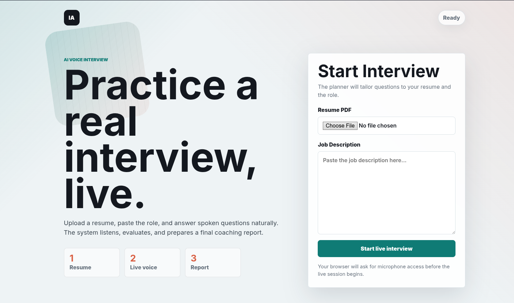
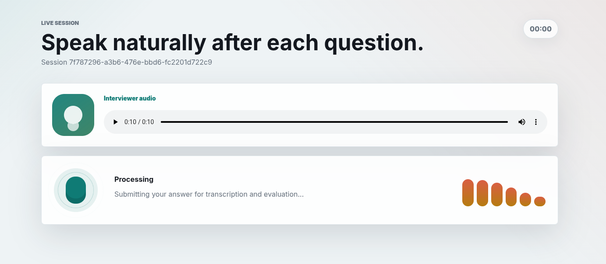
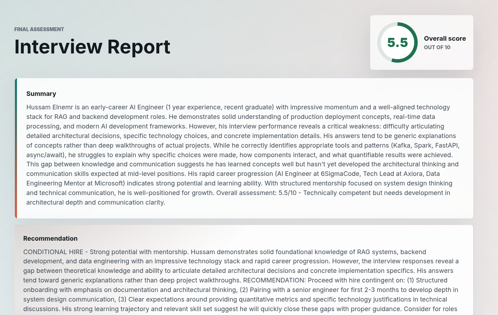
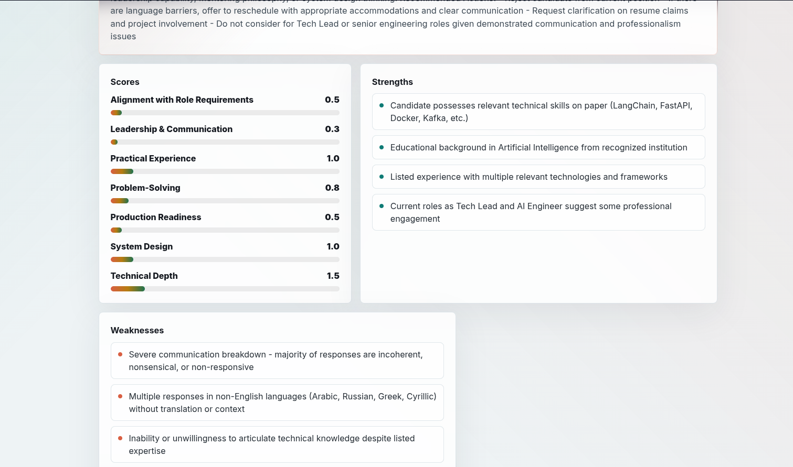

# Interview Agent

An AI-powered voice interview system built with LangGraph and Flask. It analyzes a candidate's resume and job description, generates a structured interview plan, conducts a voice interview turn by turn, and produces a final evaluation report.

## Architecture

```
interview_agent/
├── agent/                          # LangGraph multi-agent system
│   ├── Supervisor/                 # Main graph orchestrator
│   ├── subagents/
│   │   ├── planner/                # Parses resume + JD, builds interview plan
│   │   ├── interviewer/            # Generates questions
│   │   ├── router/                 # Classifies candidate answers
│   │   ├── evaluator/              # Scores answers
│   │   └── report/                 # Generates final report + coaching notes
│   ├── config/
│   │   ├── llm.py                  # LLM configuration
│   │   └── voice.py                # Local CLI voice (TTS + STT)
│   └── models.py                   # Shared Pydantic models
│
├── src/api/                        # Flask REST + WebSocket API
│   ├── app.py                      # App factory
│   ├── DTOs.py                     # Marshmallow schemas
│   ├── session_store.py            # In-memory graph session storage
│   ├── routers/
│   │   ├── interview.py            # POST /api/interview/start
│   │   └── report.py              # GET  /api/interview/<session_id>/report
│   ├── sockets/
│   │   └── interview.py            # WebSocket voice turn loop
│   └── services/
│       ├── interview.py            # PDF extraction + graph initialization
│       └── voice.py                # Byte-level TTS + STT for web API
│
├── ui/                             # Flask-served browser UI
│   ├── index.html                  # Candidate interview interface
│   ├── styles.css                  # Responsive visual design
│   └── app.js                      # REST + Socket.IO voice flow
│
├── Dockerfile                      # Container image (see Docker)
├── docker-compose.yml              # Single-service deployment
│
└── utils/                          # UI result screenshots
    ├── Home.png
    ├── live_interview.png
    ├── report_1.png
    └── report_2.png
```

## Setup

```bash
# System dependency (for local CLI mode only)
sudo apt install libportaudio2

# Python dependencies
pip install -r requirments.txt
```

Set your Anthropic API key in `.env`:
```
ANTHROPIC_API_KEY=your_key_here
```

This is required to *start* the app, not just to use it: `agent/config/llm.py`
builds its `ChatAnthropic` client at import time and that client rejects a
missing key.

## Running

```bash
python run.py
```

Server starts at `http://localhost:4567`, which also serves the browser UI:

```text
http://localhost:4567/
```

The first interview turn loads the Whisper `base` model (~150MB) on demand and
caches it for the process lifetime, so that one turn is slower than the rest.
Running in Docker avoids this — the weights are baked into the image.

### Environment variables

| Variable | Default | Description |
|---|---|---|
| `ANTHROPIC_API_KEY` | — | Required. Model used for all agents. |
| `HOST` | `127.0.0.1` | Bind address. Docker sets `0.0.0.0`. |
| `PORT` | `4567` | Listen port. |
| `DEBUG` | `1` | Flask debug/reloader. Docker sets `0`. |

## Docker

```bash
docker compose up --build
```

Serves on `http://localhost:4567`. The compose service restarts unless stopped
and has a healthcheck against `/`.

A `.env` file must exist before `docker compose up` — the service declares
`env_file: .env`, and compose errors out if the file is missing. Create it as
described in [Setup](#setup), even if the only line is `ANTHROPIC_API_KEY=`.

The image bakes the Whisper `base` weights at build time so the first interview
doesn't stall on a download, and installs `ffmpeg` (decodes the browser's
webm/opus answers) plus `libportaudio2`. It runs as a non-root `app` user, and a
single process serves the REST API, the Socket.IO endpoint, and the static UI on
one port.

## UI Results

### Home

Upload a resume PDF, paste the job description, and start a live interview.



### Live Interview

The UI plays each generated interviewer question, listens through the microphone, detects speech/silence, and submits the answer audio automatically.



### Final Report

After the interview finishes, the UI renders the final assessment, overall score, recommendation, score breakdown, strengths, weaknesses, and coaching notes.





## API

### 1. Start Interview

**POST** `/api/interview/start`

Accepts a PDF resume and job description. Runs the planner agent and returns the first interview question.

**Request:** `multipart/form-data`
| Field | Type | Description |
|---|---|---|
| `resume` | file (PDF) | Candidate's resume |
| `job_description` | string | Job description text |

**Response:**
```json
{
  "session_id": "uuid",
  "first_question": "Tell me about your experience with..."
}
```

---

### 2. Voice Interview (WebSocket)

**Connect:** `ws://localhost:4567`

#### Events (client → server)

**`join`** — start receiving questions for a session
```json
{ "session_id": "uuid" }
```

**`answer`** — send a recorded answer as audio bytes
```json
{ "session_id": "uuid", "audio": "<WAV bytes>" }
```

#### Events (server → client)

**`question`** — next interview question as MP3 audio bytes
```json
{ "audio": "<MP3 bytes>" }
```

**`finished`** — interview complete, fetch the report
```json
{}
```

**`error`** — something went wrong
```json
{ "message": "..." }
```

---

### 3. Get Report

**GET** `/api/interview/<session_id>/report`

Returns the final evaluation report and coaching notes. Only has data after the `finished` WebSocket event is received.

**Response:**
```json
{
  "final_report": { ... },
  "coaching_notes": { ... }
}
```

## Interview Flow

```
POST /start
    └── Planner parses resume + JD
    └── Returns session_id + first_question

WS join(session_id)
    └── Server sends question audio

WS answer(audio)  ←──────────────────┐
    └── STT transcribes audio         │
    └── Router classifies answer      │
    └── Evaluator scores answer       │
    └── Server sends next question ───┘
        or emits "finished"

GET /report
    └── Returns final_report + coaching_notes
```
